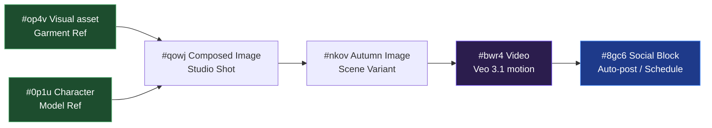

<p align="center">
  
</p>

<p align="center">
  <a href="#license"></a>
  
  
  
  
  
  
  
  
  
  
  
  
</p>
---


<p align="center">
  <b>A local-only, single-user infinite-canvas workspace for AI media workflows and automated publishing.</b><br/>
  Compose characters, products, scenes, and videos as a directed graph. Generate visual assets through a Chrome extension proxying requests to Google Flow (Veo 3.1 / GEM_PIX_2). <br/>
  Auto-post or schedule generated creatives directly to social media networks (Facebook, TikTok, YouTube, Instagram) using integrated publishing pipelines.
</p>

> **⚠ Hard requirements — read this before cloning:**
>
> 1. **Google Flow plan: `Pro` or `Ultra` only.** Veo 3.1 i2v + GEM_PIX_2 are gated to paid tiers. Confirm your plan at [labs.google/fx](https://labs.google/fx/tools/flow) before installing.
> 2. **Chrome extension is mandatory.** All generation requests are proxied through `extension/` (Chrome MV3) so the agent can use your authenticated Flow session + reCAPTCHA token.
> 3. **One LLM CLI on `PATH` for auto-prompt / vision / planner.** Flowboard ships a swappable provider layer:
>    - **Claude Code** (default, recommended) — `@anthropic-ai/claude-code`
>    - **Gemini CLI** — `@google/gemini-cli`
>    - **OpenAI Codex** — `@openai/codex` (Beta)

<p align="center">
  <a href="#why">Why</a> ·
  <a href="#demo">Demo</a> ·
  <a href="#how-it-works">How it works</a> ·
  <a href="#social-media-configuration">Configuration Guide</a> ·
  <a href="#social-block-user-guide">User Guide</a> ·
  <a href="#architecture">Architecture</a> ·
  <a href="#quickstart">Quickstart</a> ·
  <a href="#features">Features</a> ·
  <a href="skill.md">Technical Skills</a>
</p>

---

## Demo

<p align="center">
  <a href="docs/assets/flowboard-intro.mp4">
    
  </a><br/>
  <sub>End-to-end walkthrough — refs → composed image → multi-source i2v. Click for full-quality MP4.</sub>
</p>

---

## Why

E-commerce video creative is repetitive: same model, same product, many scenes, many short clips. Building it by hand in a generic Veo / Imagen UI means re-uploading character refs, re-typing prompts, and losing track of variant assets.

Flowboard treats this workflow as a graph:
- **Refs are nodes**: Upload a character or product once.
- **Composed shots are nodes**: Connect character + product to generate multi-pose scene images.
- **Videos are nodes**: Connect composed images to trigger Image-to-Video batches.
- **Social Blocks are nodes**: Select target channels, write or auto-generate captions, and instantly post or schedule posts with all connected media attached.

---

## How It Works



### 1. Visual Generation
- **Character Nodes**: Store portrait headshots to keep facial identity consistent.
- **Visual Asset Nodes**: Store product and garment references.
- **Image Nodes**: Pull upstream refs to generate custom editorial photos.
- **Storyboard Nodes**: Sequence 1–8 narrative shots with BFS dependency execution.
- **Video Nodes**: Trigger Veo 3.1 i2v motion rendering.

### 2. Auto-Prompt & Vision
The vision agent describes uploaded assets (`aiBrief`). When generating downstream nodes with empty prompts, the system compiles upstream briefs, detects scene contexts (e.g., street vs. studio), and designs tailored prompts and time-coded motion cues automatically.

### 3. Direct Posting & Scheduling (Social Blocks)
- Wire any generated Image/Video node to a **Social Block** node.
- Choose platforms (Facebook, TikTok, YouTube, Instagram).
- Write a caption (or click **Generate AI** to synthesize one based on connected visuals).
- **🚀 Đăng nhanh (Auto)**: Instantly uploads connected images/videos to social platforms (e.g., via Facebook Graph API as unpublished gallery media) and publishes the post.
- **📅 Schedule**: Specify Date/Time to queue posts in SQLite. The FastAPI background scheduler checks for due items every 60 seconds and auto-publishes them.

---

## Social Media Configuration

To use the **Social Block** auto-post and scheduling features, you need to configure access credentials in your environment file.

### 📱 Facebook Page Integration Setup
Add your Page Credentials directly to the `agent/.env` file:

```env
# Facebook Page Credentials
FB_PAGE__ID=your_facebook_page_id
FB_PAGE__ACCESS_TOKEN=your_facebook_page_permanent_access_token
```

#### How to obtain these values:
1. **Get Page ID**: Open your Facebook Page ➔ Go to **About** ➔ **Page transparency** ➔ Copy **Page ID**.
2. **Get Permanent Access Token**:
   - Go to [Facebook Developers](https://developers.facebook.com/) and create a business App.
   - Use the **Graph API Explorer** tool.
   - Select your App, choose **User Token**, and add these permissions: `pages_show_list`, `pages_read_engagement`, `pages_manage_posts`, `publish_video`.
   - Click **Generate Access Token** and approve permissions.
   - Under the "Page Token" dropdown, select your target Page. Copy the generated token.
   - **Convert to Permanent Token**: Use the Access Token Debugger to extend the token lifetime to a permanent page token.

---

## Social Block User Guide

Once credentials are configured, managing social publications from the canvas is completely seamless:

### 1. Connecting Nodes
- Add a **Social Block** node to the canvas using the quick palette (`Right-click` ➔ `Social Block`).
- Connect any **Image** or **Video** node containing your generated creative content to this Social Block.

### 2. Composing the Post
- Double-click the Social Block node to open the editor.
- **Select Platforms**: Toggle target platform chips (e.g., **Facebook**).
- **Draft Caption**: Write your post caption directly, or click **🤖 Generate AI** to automatically synthesize an attractive caption with matching emojis based on the visual descriptors from your connected nodes.
- **Auto-Save**: The draft caption and platform state are automatically saved every 1 second.

### 3. Publishing and Scheduling
- **🚀 Direct Posting**: Click **Đăng nhanh (Auto)** to publish immediately via Graph API. The system uploads all connected images/videos directly and maps the returned post ID.
- **📅 Scheduling**: Click **📅 Schedule** inside the dialog. A simplified scheduler modal opens:
  - Select your desired **Date** and **Time**.
  - Click **Schedule Post**.
  - *No need to click any outer save buttons.* The caption, media assets, and scheduled time are automatically written directly to the SQLite scheduling queue.
  - The background scheduler thread runs every 60 seconds and automatically publishes the post at the exact second it is due!

---

## Architecture

```
┌──────────────────────┐    ┌────────────────────┐    ┌──────────────────────┐
│  Chrome MV3 ext      │◄───┤  FastAPI agent     ├───►│  SQLite (storage/)   │
│  - content script    │ WS │  127.0.0.1:8101    │    │  Board, Node, Edge,  │
│  - injected MAIN     │ ws │  + worker queue    │    │  Request, Asset,     │
│  - Captcha bridge    │9223│  + WS server :9223 │    │  SocialBlockPost...  │
└──────────────────────┘    └─────────┬──────────┘    └──────────────────────┘
                                      │
                                      ▼
                            ┌────────────────────┐
                            │  React + Vite      │
                            │  ReactFlow canvas  │
                            └────────────────────┘
```

- **Frontend**: Vite + React 18 + ReactFlow 12 + Zustand 5. Infinite canvas interface.
- **Backend Agent**: FastAPI + SQLModel + SQLite. Hosts API routes, execution workers, background scheduler, and the local file cache.
- **Extension**: Intercepts Flow network calls to proxy credentials to local WebSockets securely.

---

## Quickstart

### Prerequisites
- **Python 3.11** and **Node.js 20+**
- **Chrome browser** (Developer Mode enabled)
- **Google Flow Pro/Ultra account**
- **One LLM CLI** on `PATH` (e.g., Claude Code, Gemini CLI, or OpenAI Codex)

### Setup Commands
We provide a simple Makefile for easy installation:
```bash
make install        # Install virtual environment and frontend deps
make agent          # Start FastAPI agent on port 8101
make frontend       # Start Vite dev server on port 1234
```

1. Load `extension/` unpacked in Chrome (`chrome://extensions/`).
2. Log into [labs.google/fx/tools/flow](https://labs.google/fx/tools/flow).
3. Open `http://localhost:1234` to start composing on the canvas.

For testing:
```bash
cd agent && .venv/bin/python -m pytest -q    # Runs 333 backend tests
```

---

## Features

- **Character & Visual Asset Management**: Hard-anchored references for consistent outputs.
- **Multi-Reference Composition**: Splicing model refs and garment refs into environment-aware scenes.
- **Multi-Source Video Synthesis**: One-click generation of multiple motion clips from different image variants.
- **Storyboard Pipelines**: Narrative workflows executing scene continuations and retries.
- **Social Block Publishing Engine**: 
  - Auto-generation of platform-specific captions.
  - Multi-media uploading support.
  - Background cron worker for precise date/time scheduling.
- **Ergonomic Canvas Tools**: Quick-add menus, easy edge deletion, activity logging dropdown, and multi-board setups.

---

## License

MIT License.
