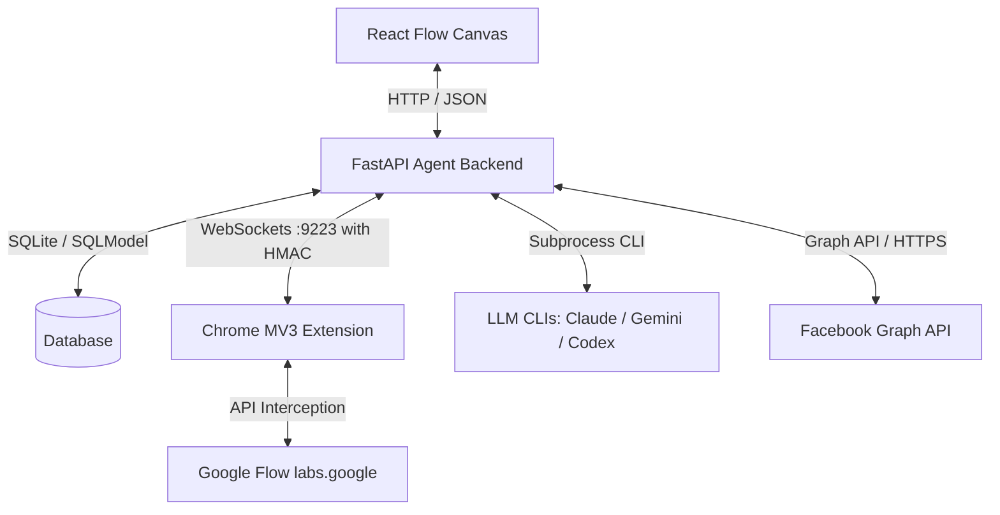

# Flowboard Technical Skills & Architectural Patterns

This document details the core technical skills, architectural patterns, and integrations used throughout the Flowboard project. It serves as a rapid onboarding guide for developers or agentic tools to understand *how* the codebase is constructed and the engineering decisions behind it.

---

## 🏗️ 1. System Architecture & Flow

---

## 🎨 2. Frontend Development

### **React 18 & TypeScript (Strict)**
- **Component Design**: Functional components, custom hooks, and strict prop typing.
- **Dynamic CSS Systems**: Vanilla CSS with modern styling (flexbox, grid layouts, transitions, dark-mode styling, glassmorphism).

### **React Flow 12**
- **Infinite Canvas**: Interactive nodes (custom types like Character, Visual Asset, Image, Storyboard, Video, Social Block) and edges (transparent 24px hit-slop for easy grabbing).
- **Edge Connections**: Dynamic edge-drawing with add-node popovers on drag-to-empty, allowing users to build visual generation pipelines.

### **State Management (Zustand 5)**
- **Centralized Slices**: Structured stores for board nodes/edges, active generations, LLM settings, and UI toasts.
- **Autosave Engine**: Automatic local-state debouncing (1s) to save canvas positions and content parameters before syncing with the backend.

---

## ⚙️ 3. Backend Development & Worker Services

### **FastAPI & Asyncio**
- **Lifespan Manager**: Orchestrates the startup/shutdown of multiple services: WebSockets, worker queues, and the background post scheduler.
- **SQLite Database Integration**: Powered by **SQLModel** (SQLAlchemy + Pydantic). Includes automated migrations and JSON field mapping for arbitrary node configuration storage.

### **Asynchronous Worker Queue**
- **Task Dispatcher**: Processes visual generation pipeline tasks (`gen_image`, `gen_video`, `edit_image`, `upload_image`) asynchronously without blocking HTTP request threads.
- **Robust Exception Handling**: Automatically transitions node statuses (`running` ➔ `posted` / `failed`) and surfaces error codes to the client.

---

## 🤖 4. AI Provider Integration (Subprocess Bridge)

Instead of direct HTTP cloud API keys, Flowboard uses a **subprocess provider layer** to shell out to developer CLIs that are already authenticated via OAuth on the host machine:

1. **Claude Code** (`@anthropic-ai/claude-code`): Default high-performance provider.
2. **Gemini CLI** (`@google/gemini-cli`): Official Google AI CLI wrapper.
3. **OpenAI Codex** (`@openai/codex`): ChatGPT-based wrapper.

### **Prompt & Motion Synthesis**
- **Vision Describe**: Uses CLI attachment paths to write metadata (`aiBrief`) for images automatically.
- **Contextual Auto-Prompt**: Walks upstream graph nodes, compiles individual briefs, and synthesizes fashion-editorial style prompts with diverse poses.
- **Scene-Aware Motion**: Compiles time-coded motion instructions based on detected environments (e.g., street walk-and-glance vs. indoor café sipping).

---

## 📱 5. Social API Integration & Background Scheduling

Flowboard includes direct-posting (Auto-post) and scheduling to social media platforms, with a focus on Facebook.

### **Facebook Graph API Integration**
- **Multi-Photo Posting Pattern**:
  1. Uploads multiple connected visual assets individually as **unpublished photos** (`published=false`) to the `/photos` endpoint, returning multiple photo IDs.
  2. Publishes a single feed post (`/feed`) containing the caption and references the photo IDs using `attached_media`, creating a unified gallery post.
- **Page Access Tokens**: Dynamically switches between system environment variables (`FB_PAGE__ACCESS_TOKEN`) and user-authenticated OAuth credentials stored in SQLite.

### **Cron-like Background Scheduler**
- **Precision Loop**: Runs an asynchronous loop checking for due scheduled items (`scheduled_time <= now`) every 60 seconds.
- **Transaction Safety**: Performs database state transitions (`pending` ➔ `posted`/`failed`) within an ACID-compliant transaction context block.

---

## 🔌 6. Extension Bridge Pattern

To bypass reCAPTCHA and complex cookie handling, Flowboard uses a Chrome Extension to proxy API requests to Google Flow:

- **MV3 Content Script**: Injected into `labs.google/fx/tools/flow` to capture session auth tokens.
- **MAIN World Script Injection**: Overrides/intercepts page-level network requests (`multimodal-fetch`) to capture the active reCAPTCHA token payload.
- **HMAC Secure WebSockets**: Sends captured credentials to the FastAPI backend over local loopback using a shared HMAC handshake key.
